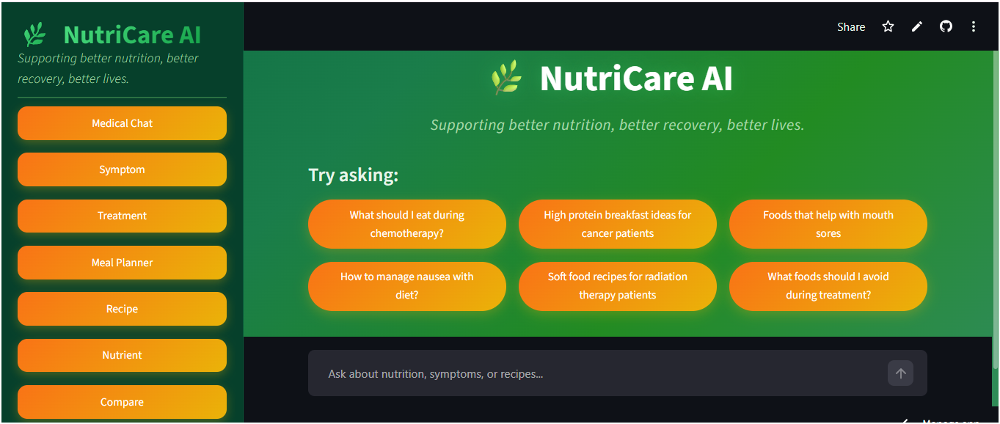

# 🌿 NutriCare AI

### An Intelligent Multilingual AI-Powered Nutrition & Diet Assistant for Cancer Patients using RAG and LLMs

> **Supporting better nutrition, better recovery, better lives.**

[](https://www.python.org/)
[](https://streamlit.io/)
[](https://faiss.ai/)
[](https://www.llama.com/)
[](#)


**NutriCare AI** is a multimodal, multilingual AI-powered nutrition assistant designed to provide evidence-based dietary guidance for cancer patients, caregivers, and healthcare-support contexts.

The application combines **Retrieval-Augmented Generation (RAG)**, **semantic search**, **FAISS vector retrieval**, **LLM-based response generation**, **multilingual translation**, **text-to-speech**, nutrition databases, and external APIs through an interactive **Streamlit** interface.

---

## 🌐 Live Demo

🚀 **Try NutriCare AI:**
**https://nutricare-ai-llm.streamlit.app/**

> The live application may have limited functionality depending on API availability and deployment resources.
## 📸 Dashboard



---

## ✨ Key Features

### 💬 Medical Chat

Ask nutrition-related questions and receive context-aware responses based on the project's curated medical knowledge base.

### 🩺 Symptom Diet Assistant

Provides dietary guidance for treatment-related symptoms such as:

* Nausea
* Constipation
* Loss of appetite
* Taste changes
* Mouth sores
* Fatigue
* Dehydration

### 💉 Treatment Diet Assistant

Provides nutrition guidance based on treatment context, including:

* Chemotherapy
* Radiation therapy
* Surgery
* Recovery

### 🍽️ Personalized Meal Planner

Generates meal plans based on user-provided information such as:

* Age
* Gender
* Dietary preference
* Treatment
* Symptoms
* Cuisine
* Number of meals

### 🥘 AI Recipe Generator

Generates recipes based on available ingredients and provides nutritional information and cooking instructions.

Recipe-related video recommendations can also be obtained using the YouTube Data API.

### 🥦 Nutrient Lookup

Search nutritional information for **2,110+ Indian foods** using the project's nutrition database.

### 📊 Food Comparison

Compare two foods based on nutrients such as:

* Energy
* Protein
* Fat
* Carbohydrates
* Fiber
* Calcium
* Iron

### 🌿 Ayurvedic Remedies

Allows users to search traditional Ayurvedic resources and upload relevant PDF documents for retrieval-based querying.

### 🗂️ Chat History

Conversation history is stored using SQLite and can be viewed through a conversational interface.

### 🌐 Multilingual Support

Supports:

* 🇬🇧 English
* 🇮🇳 Hindi
* 🇮🇳 Marathi

Translation is handled using Google Translate integration.

### 🔊 Text-to-Speech

Responses can be converted to speech using **gTTS** and played through the application.

---

# 🧠 How NutriCare AI Works

NutriCare AI follows a Retrieval-Augmented Generation pipeline.

```text
                User Question
                     │
                     ▼
             Language Detection
                     │
                     ▼
             Query Processing
                     │
                     ▼
        Sentence Transformer Model
          all-MiniLM-L6-v2
                     │
                     ▼
              FAISS Search
             Top-K Retrieval
                     │
                     ▼
          Metadata Filtering
           Module-specific
                     │
                     ▼
             Context Building
                     │
                     ▼
            Prompt Construction
       Context + History + Query
                     │
                     ▼
          Llama 3.3 70B via Groq
                     │
                     ▼
           Generated Response
                     │
              ┌──────┴──────┐
              ▼             ▼
        Translation       Source
              │         Attribution
              ▼
          Final Answer
              │
       ┌──────┴────────┐
       ▼               ▼
   Text Display      Text-to-Speech
```

---

# 📚 Knowledge Base & Datasets

## 🏥 Medical Knowledge Base

The project contains a curated medical knowledge base covering topics such as:

* Cancer nutrition
* Treatment-based nutrition
* Symptom management
* Nutrients
* Food safety
* Meal planning
* Recipe guidelines
* FAQs
* Medical glossary

The documents are converted into chunks and indexed using FAISS for semantic retrieval.

**Current scale:**

* 80+ curated medical documents
* 1,406 indexed chunks
* 500-character chunk size
* 50-character overlap
* Metadata attached to each chunk

Sources include reputable organisations such as:

* National Cancer Institute (NCI)
* American Cancer Society (ACS)
* World Health Organization (WHO)
* Mayo Clinic
* ICMR
* National Institute of Nutrition (NIN)

---

## 🥗 Indian Food Nutrition Database

The project includes a CSV-based Indian food nutrition database containing **2,110+ food items**.

Example nutritional attributes include:

* Energy
* Protein
* Fat
* Carbohydrates
* Fiber
* Calcium
* Iron
* Vitamins
* Other nutritional values

This database powers the **Nutrient Lookup** and **Food Comparison** modules.

---

## 🍛 Recipe Database

The project contains **100+ Indian recipes** with information such as:

* Recipe name
* Cuisine
* Ingredients
* Cooking instructions
* Cooking time
* Calories
* Protein
* Carbohydrates

---

# 🛠️ Technology Stack

| Category             | Technology                         |
| -------------------- | ---------------------------------- |
| Programming Language | Python                             |
| Frontend             | Streamlit                          |
| LLM                  | Llama 3.3 70B via Groq             |
| Embeddings           | Sentence Transformers              |
| Embedding Model      | all-MiniLM-L6-v2                   |
| Vector Database      | FAISS                              |
| Translation          | Google Translate / deep-translator |
| Text-to-Speech       | gTTS + pygame                      |
| Image Understanding  | CLIP                               |
| Database             | SQLite                             |
| PDF Processing       | PyPDF2                             |
| PDF Generation       | ReportLab                          |
| Data Processing      | Pandas                             |
| Visualization        | Altair                             |
| Recipe Videos        | YouTube Data API                   |
| Nutrition API        | Spoonacular                        |
| Book Search          | Google Custom Search               |

---

# 🔌 External APIs

NutriCare AI integrates multiple external services:

### 1. Groq

Used for LLM-based response generation.

### 2. Google Translate

Used for multilingual response translation.

### 3. YouTube Data API

Used to search for recipe-related videos.

### 4. Spoonacular API

Used to obtain additional nutrition and food information.

### 5. Google Custom Search API

Used for searching Ayurvedic book and resource information.

> API keys are stored locally using environment variables and are **not included in the repository**.

---

# 🚀 Quick Start

## 1. Clone the Repository

```bash
git clone https://github.com/DimpalTamta/NutriCare-AI.git
cd NutriCare-AI
```

## 2. Create a Virtual Environment

### Windows

```bash
python -m venv venv
venv\Scripts\activate
```

### macOS / Linux

```bash
python3 -m venv venv
source venv/bin/activate
```

## 3. Install Dependencies

```bash
pip install -r requirements.txt
```

---

## 4. Configure API Keys

Create a `.env` file in the project root.

```env
GROQ_API_KEY=your_groq_api_key
YOUTUBE_API_KEY=your_youtube_api_key
SPOONACULAR_API_KEY=your_spoonacular_api_key
GOOGLE_CUSTOM_SEARCH_API_KEY=your_google_custom_search_api_key
GOOGLE_CUSTOM_SEARCH_ENGINE_ID=your_search_engine_id
```

**Never commit the `.env` file to GitHub.**

The repository should contain a `.gitignore` entry such as:

```gitignore
.env
*.db
__pycache__/
.venv/
venv/
```

---

# 📦 Build the FAISS Index

If the FAISS index is not already included in the repository, build it using the project's indexing script.

For example:

```bash
python build_index.py
```

> Use the actual index-building script/file name present in this repository. Avoid copying a command here that does not exactly match the current project structure.

The resulting index contains the embedded knowledge-base chunks used during retrieval.

---

# ▶️ Run the Application

```bash
streamlit run app.py
```

The application will open in your browser.

Default local address:

```text
http://localhost:8501
```

---

# 📁 Project Structure

```text
NutriCare-AI/
│
├── app.py
│
├── rag/
│   ├── load_documents.py
│   ├── chunking.py
│   ├── vector_store.py
│   └── ...
│
├── llm/
│   └── ...
│
├── memory/
│   └── ...
│
├── voice/
│   └── ...
│
├── nutrition/
│   └── ...
│
├── recipe/
│   └── ...
│
├── utils/
│   └── ...
│
├── knowledge_base/
│   └── ...
│
├── data/
│   ├── indian_food_database.csv
│   └── recipes.csv
│
├── requirements.txt
├── .gitignore
└── README.md
```

> Adjust this tree to exactly match your repository. Do not list folders that do not actually exist.

---

# 📊 RAG Configuration

| Component         | Configuration       |
| ----------------- | ------------------- |
| Embedding Model   | all-MiniLM-L6-v2    |
| Vector Database   | FAISS               |
| Vector Dimension  | 384                 |
| Chunk Size        | 500 characters      |
| Chunk Overlap     | 50 characters       |
| Retrieved Results | Top 5               |
| Retrieval Method  | Semantic Similarity |
| Filtering         | Metadata-based      |
| Generation Model  | Llama 3.3 70B       |

---

# 🧩 Application Modules

```text
NutriCare AI
│
├── Medical Chat
├── Symptom Diet Assistant
├── Treatment Diet Assistant
├── Personalized Meal Planner
├── AI Recipe Generator
├── Nutrient Lookup
├── Food Comparison
├── Ayurvedic Remedies
├── Chat History
└── About Us
```

---

# 📸 Screenshots

Add screenshots of the **actual running application** here.

Recommended screenshots:

| Module              | Screenshot                     |
| ------------------- | ------------------------------ |
| Dashboard           | `screenshots/dashboard.png`    |
| Medical Chat        | `screenshots/medical-chat.png` |
| Symptom Assistant   | `screenshots/symptom.png`      |
| Treatment Assistant | `screenshots/treatment.png`    |
| Meal Planner        | `screenshots/meal-planner.png` |
| Recipe Generator    | `screenshots/recipe.png`       |
| Nutrient Lookup     | `screenshots/nutrient.png`     |
| Food Comparison     | `screenshots/comparison.png`   |
| Ayurvedic Remedies  | `screenshots/ayurvedic.png`    |
| Chat History        | `screenshots/history.png`      |

Example:

```markdown

```

A **3–5 screenshot selection** is enough for the README. Your complete set of screenshots can remain in your academic documentation.

---

# 🔐 Security

API credentials are loaded through environment variables.

Sensitive files such as:

```text
.env
*.db
```

should not be committed to the repository.

Before publishing the repository, verify that no API keys or other credentials exist in:

* Source code
* Git history
* `.env` files
* Configuration files
* Notebook outputs

---

# ⚠️ Medical Disclaimer

NutriCare AI is an **academic AI project and educational prototype**.

The information provided by the application is not a substitute for professional medical diagnosis, treatment, or personalised advice from a qualified oncologist, registered dietitian, or other healthcare professional.

Patients should consult their healthcare provider before making significant dietary or treatment-related decisions.

---

# 🎓 Academic Information

**Project:** NutriCare AI

**Course:** Large Language Models (LLM)

**Programme:** MCA – Semester III

**Department:** P.G. Department of Computer Science

**University:** SNDT Women's University

**Academic Year:** 2026–27

**Student:** Dimpal Tamta

**Roll No.:** MC2561

**Faculty:** Sarita Chauhan

---

# 👨‍💻 Developer

**Dimpal Tamta**

MCA Student | AI • Machine Learning • Data Science

GitHub: **[@DimpalTamta](https://github.com/DimpalTamta)**

---

# 🙏 Acknowledgements

This project uses information and resources from reputable organisations and datasets, including:

* National Cancer Institute (NCI)
* American Cancer Society (ACS)
* World Health Organization (WHO)
* Mayo Clinic
* Indian Council of Medical Research (ICMR)
* National Institute of Nutrition (NIN)

The project also uses open-source technologies and libraries including Streamlit, FAISS, Sentence Transformers, PyTorch, Pandas, and related Python packages.

---

# 📌 Project Status

**Status:** Completed Academic Prototype

NutriCare AI demonstrates the integration of:

* Retrieval-Augmented Generation
* Large Language Models
* Semantic Search
* Vector Databases
* Multilingual AI
* Nutrition Data Processing
* Voice Interaction
* External APIs
* Persistent Chat History
* Streamlit Application Development

---

## 📜 License

This project was developed for academic and educational purposes.
